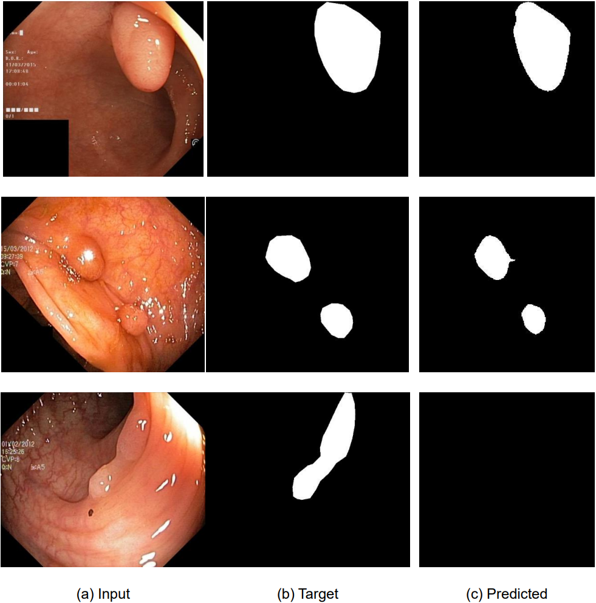

# pytorch-unet-segmentation

Implementation of Unet Model for Biomedical Image Segmentation based on PyTorch platform

## U-Net

Paper: Convolutional Networks for Biomedical Image Segmentation (https://arxiv.org/abs/1505.04597)

## Dataset

Kvasir-SEG (https://datasets.simula.no/kvasir-seg/)  

Train: 900 / Test: 100

## Visual results

## Quantitative results

| Metric   | Score           |
| -------- | --------------- |
| MDice    | 0.8906          |
| PA       | 0.9442          |
| MPA      | 0.8733          |
| MIoU     | 0.8114          |
| FWIoU    | 0.8968          |
| ClassIoU | 0.9365 / 0.6863 |

